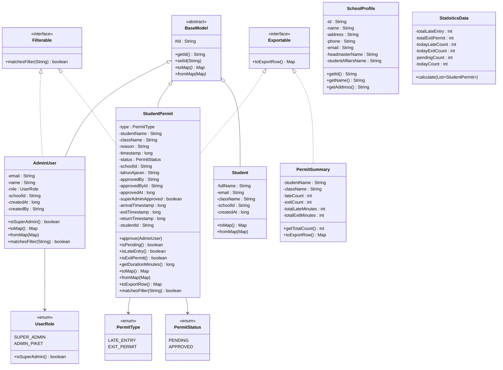
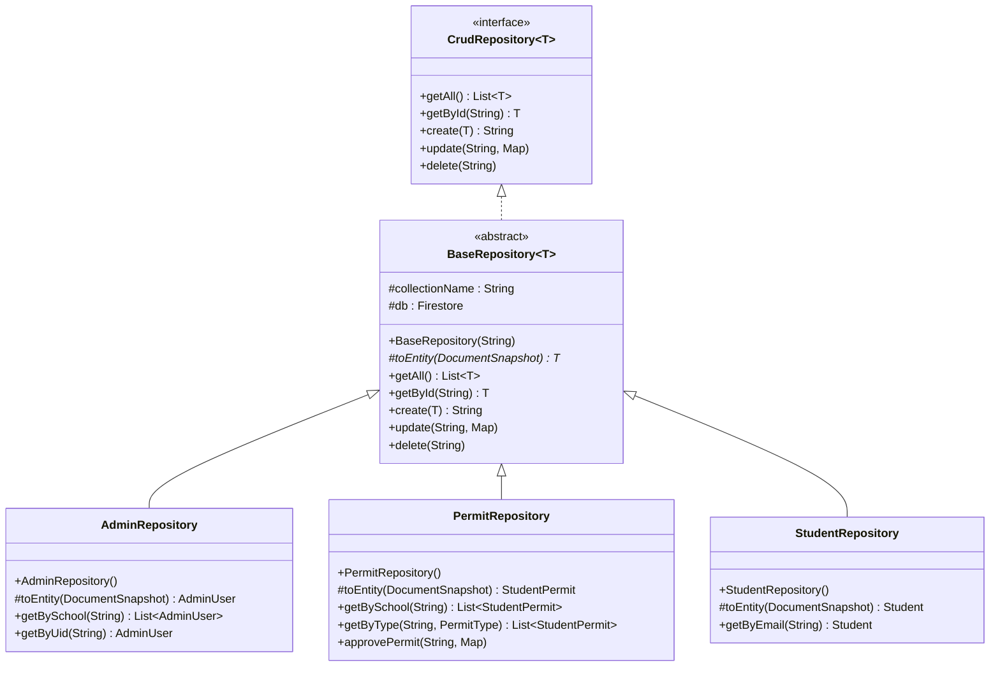
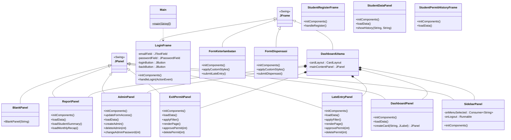
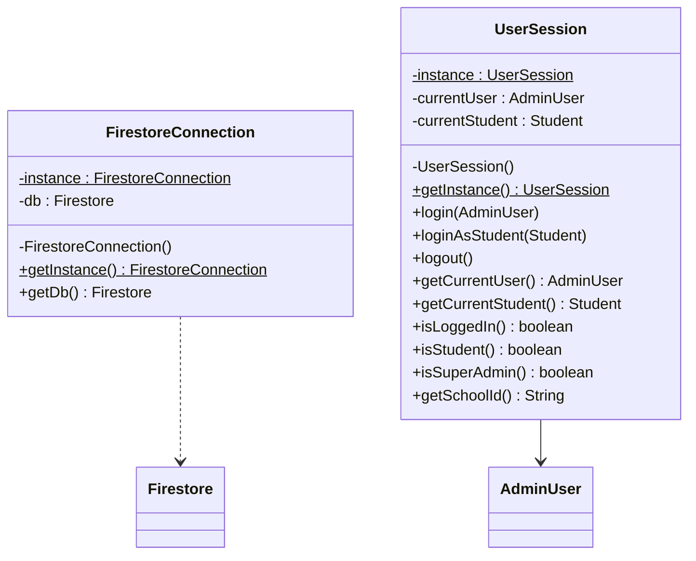
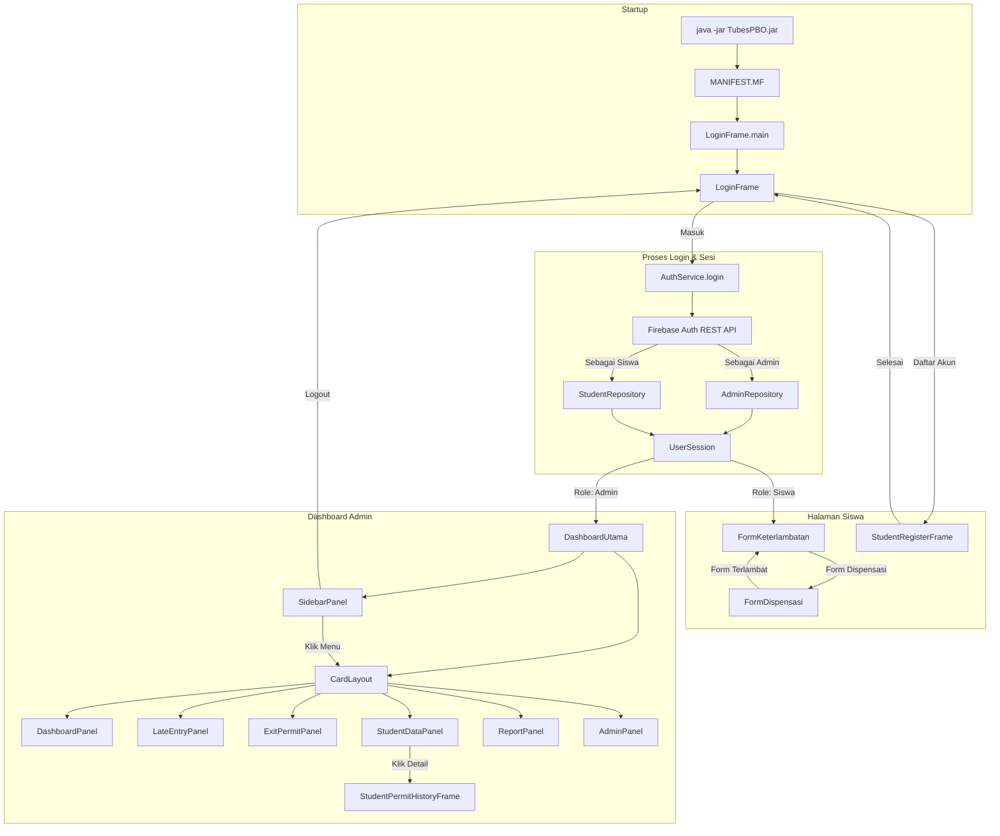
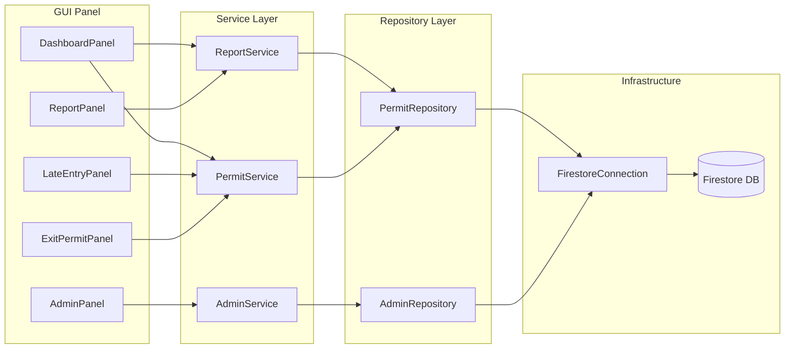

# 📘 Dokumentasi Proyek — SmartSchool Permit System (TubesPBO)

> **Aplikasi Java Desktop (Swing)** untuk manajemen surat izin siswa (terlambat masuk & izin keluar) di lingkungan sekolah menengah. Terhubung ke **Google Cloud Firestore** sebagai database.

---

## 📋 Daftar Isi

- [📘 Dokumentasi Proyek — SmartSchool Permit System (TubesPBO)](#-dokumentasi-proyek--smartschool-permit-system-tubespbo)
  - [📋 Daftar Isi](#-daftar-isi)
  - [🏗 Gambaran Umum Arsitektur](#-gambaran-umum-arsitektur)
  - [📊 Class Diagram](#-class-diagram)
    - [Diagram Utama — Model \& Repository](#diagram-utama--model--repository)
    - [Diagram Repository Layer](#diagram-repository-layer)
    - [Diagram Service Layer](#diagram-service-layer)
    - [Diagram GUI Layer](#diagram-gui-layer)
    - [Diagram Infrastruktur (Singleton)](#diagram-infrastruktur-singleton)
  - [📂 Struktur Package](#-struktur-package)
  - [📖 Detail Modul \& Class](#-detail-modul--class)
    - [Modul 1: Application Core (`app`)](#modul-1-application-core-app)
    - [Modul 2: Data Model (`model` + `model.enums`)](#modul-2-data-model-model--modelenums)
      - [Class \& Interface](#class--interface)
      - [Enum](#enum)
    - [Modul 3: Data Access / Repository (`repository`)](#modul-3-data-access--repository-repository)
    - [Modul 4: Business Logic / Service (`service`)](#modul-4-business-logic--service-service)
    - [Modul 5: Utility (`util`)](#modul-5-utility-util)
    - [Modul 6: GUI — Login \& Form Publik (`gui.login` + `gui.formDispen`)](#modul-6-gui--login--form-publik-guilogin--guiformdispen)
    - [Modul 7: GUI — Dashboard Admin (`gui.dashboard` + `gui.widget`)](#modul-7-gui--dashboard-admin-guidashboard--guiwidget)
  - [🎓 Konsep OOP yang Digunakan](#-konsep-oop-yang-digunakan)
  - [👥 Pembagian Penanggung Jawab](#-pembagian-penanggung-jawab)
  - [📊 Ringkasan Statistik Proyek](#-ringkasan-statistik-proyek)
  - [🚀 Proses Build ke .JAR \& Cara Menjalankan](#-proses-build-ke-jar--cara-menjalankan)
  - [🔄 Flow Navigasi Aplikasi (Antar Tampilan / Screen)](#-flow-navigasi-aplikasi-antar-tampilan--screen)
  - [📌 Rangkuman Flow untuk Presentasi](#-rangkuman-flow-untuk-presentasi)

---

## 🏗 Gambaran Umum Arsitektur

Proyek ini mengikuti arsitektur **3-Layer (Layered Architecture)**:

```
┌────────────────────────────────────────────┐
│              GUI / Presentation            │ ← Swing JFrame & JPanel
│  (login, formDispen, dashboard, widget)    │
├────────────────────────────────────────────┤
│            Service / Business Logic        │ ← Logika bisnis & validasi
│      (AuthService, PermitService, dll)     │
├────────────────────────────────────────────┤
│         Repository / Data Access           │ ← CRUD ke Firestore
│    (BaseRepository, PermitRepository, dll) │
├────────────────────────────────────────────┤
│           Model / Domain Entity            │ ← POJO, Enum, Interface
│     (BaseModel, StudentPermit, dll)        │
├────────────────────────────────────────────┤
│            App / Infrastructure            │ ← Koneksi DB, Session
│     (FirestoreConnection, UserSession)     │
└────────────────────────────────────────────┘
```

---

## 📊 Class Diagram

### Diagram Utama — Model & Repository



### Diagram Repository Layer



### Diagram Service Layer

```mermaid
classDiagram
    direction LR

        -adminRepo : AdminRepository
        -studentRepo : StudentRepository
        -API_KEY : String
        +login(String, String) Object
        +logout()
    }

    class AdminService {
        -adminRepo : AdminRepository
        -API_KEY : String
        +getAllAdmins(String) List~AdminUser~
        +createAdmin(String, String, String, String) AdminUser
        +deleteAdmin(String)
        +changePassword(String, String)
    }

    class PermitService {
        -permitRepo : PermitRepository
        +getAllPermits(String) List~StudentPermit~
        +getPermitsByType(String, PermitType) List~StudentPermit~
        +createPermit(StudentPermit) String
        +updatePermit(String, StudentPermit)
        +deletePermit(String)
        +approvePermit(String, AdminUser)
        +filterPermits(List, String, String) List~StudentPermit~
    }

    class ReportService {
        -permitRepo : PermitRepository
        +getDashboardStats(String) StatisticsData
        +getStudentSummary(String) List~PermitSummary~
        +getMonthlyRecap(String, int, int) Map
    }

    AuthService --> AdminRepository
    AdminService --> AdminRepository
    PermitService --> PermitRepository
    ReportService --> PermitRepository
```

### Diagram GUI Layer



### Diagram Infrastruktur (Singleton)



---

## 📂 Struktur Package

```
com.smartschool.permit.tubespbo
├── TubesPBO.java                    ← Entry point awal (Hello World)
│
├── app/                             ← Infrastruktur & Konfigurasi
│   ├── FirestoreConnection.java     ← Singleton koneksi Firestore
│   ├── UserSession.java             ← Singleton session user login
│   ├── MainApp.java                 ← Test koneksi Firebase
│   └── TestCRUD.java                ← Integration test CRUD
│
├── model/                           ← Domain Entity / POJO
│   ├── BaseModel.java               ← Abstract base (id, toMap, fromMap)
│   ├── AdminUser.java               ← Model admin piket / super admin
│   ├── StudentPermit.java           ← Model surat izin siswa
│   ├── SchoolProfile.java           ← Profil sekolah (hardcoded)
│   ├── PermitSummary.java           ← Ringkasan izin per siswa
│   ├── StatisticsData.java          ← Data statistik dashboard
│   ├── Exportable.java              ← Interface untuk export data
│   ├── Filterable.java              ← Interface untuk filter/search
│   └── enums/
│       ├── PermitStatus.java        ← Enum: PENDING, APPROVED
│       ├── PermitType.java          ← Enum: LATE_ENTRY, EXIT_PERMIT
│       └── UserRole.java            ← Enum: SUPER_ADMIN, ADMIN_PIKET
│
├── repository/                      ← Data Access Layer (Firestore CRUD)
│   ├── CrudRepository.java          ← Interface generik CRUD
│   ├── BaseRepository.java          ← Abstract class implementasi CRUD
│   ├── AdminRepository.java         ← Repository koleksi "admins"
│   └── PermitRepository.java        ← Repository koleksi "permits"
│
├── service/                         ← Business Logic Layer
│   ├── AuthService.java             ← Login/Logout via Firebase Auth REST
│   ├── AdminService.java            ← CRUD admin + reset password
│   ├── PermitService.java           ← CRUD izin + approve + filter
│   └── ReportService.java           ← Statistik, summary, rekap bulanan
│
├── util/                            ← Helper / Utility
│   ├── DateUtils.java               ← Format tanggal/waktu (Asia/Jakarta)
│   ├── SchoolUtils.java             ← Tahun ajaran, daftar kelas
│   └── XlsxUtils.java              ← Export tabel Swing ke file .xlsx
│
└── gui/                             ← Presentation Layer (Swing)
    ├── login/
    │   ├── Main.java                ← Entry point utama aplikasi
    │   ├── LoginFrame.java          ← Form login admin & siswa
    │   └── StudentRegisterFrame.java ← Form registrasi siswa baru
    │
    ├── formDispen/
    │   ├── FormKeterlambatan.java    ← Form input siswa terlambat (pribadi)
    │   └── FormDispensasi.java      ← Form input izin keluar (pribadi)
    │
    ├── dashboard/
    │   ├── DashboardUtama.java      ← Frame utama dashboard (CardLayout)
    │   ├── DashboardPanel.java      ← Panel ringkasan & statistik
    │   ├── LateEntryPanel.java      ← Panel kelola siswa terlambat
    │   ├── ExitPermitPanel.java     ← Panel kelola izin keluar
    │   ├── ReportPanel.java         ← Panel laporan & rekap
    │   ├── StudentDataPanel.java    ← Panel data & analitik siswa
    │   ├── StudentPermitHistoryFrame.java ← Popup riwayat per siswa
    │   ├── AdminPanel.java          ← Panel kelola akun admin
    │   └── BlankPanel.java          ← Placeholder halaman belum jadi
    │
    └── widget/
        └── SidebarPanel.java        ← Komponen sidebar navigasi
```

---

## 📖 Detail Modul & Class

---

### Modul 1: Application Core (`app`)

**Fungsi:** Menyediakan infrastruktur dasar aplikasi — koneksi database dan manajemen session.

| #   | Class                 | Tipe              | Baris | Deskripsi                                                                                                                                                                                                 |
| --- | --------------------- | ----------------- | ----- | --------------------------------------------------------------------------------------------------------------------------------------------------------------------------------------------------------- |
| 1   | `FirestoreConnection` | Class (Singleton) | 58    | Mengelola koneksi tunggal ke Google Cloud Firestore menggunakan **Singleton Pattern**. Membaca `serviceAccountKey.json` dari resources, inisialisasi `FirebaseApp`, dan menyediakan instance `Firestore`. |
| 2   | `UserSession`         | Class (Singleton) | 48    | Menyimpan state session user yang sedang login menggunakan **Singleton Pattern**. Menyediakan helper seperti `isLoggedIn()`, `isSuperAdmin()`, dan `getSchoolId()`.                                       |
| 3   | `MainApp`             | Class             | 23    | Class sederhana untuk **test koneksi** ke Firebase secara standalone.                                                                                                                                     |
| 4   | `TestCRUD`            | Class             | 90    | **Integration test** yang menguji alur lengkap: Create → Read → Approve → Delete pada data izin siswa via `PermitService`.                                                                                |

**Design Pattern:** Singleton (pada `FirestoreConnection` dan `UserSession`)

---

### Modul 2: Data Model (`model` + `model.enums`)

**Fungsi:** Mendefinisikan struktur data (entity) yang merepresentasikan objek domain bisnis.

#### Class & Interface

| #   | Class/Interface  | Tipe               | Baris | Deskripsi                                                                                                                                                                                                                                                                                       |
| --- | ---------------- | ------------------ | ----- | ----------------------------------------------------------------------------------------------------------------------------------------------------------------------------------------------------------------------------------------------------------------------------------------------- |
| 1   | `BaseModel`      | **Abstract Class** | 27    | Base class untuk semua entity. Memiliki field `id` dan mendefinisikan method abstract `toMap()` dan `fromMap()` untuk konversi dari/ke Firestore document.                                                                                                                                      |
| 2   | `AdminUser`      | Class              | 81    | Merepresentasikan akun admin (piket/super admin). Extends `BaseModel`, implements `Filterable`. Memiliki field: `email`, `name`, `role`, `schoolId`, `createdAt`, `createdBy`. Method `isSuperAdmin()` untuk cek role.                                                                          |
| 3   | `StudentPermit`  | Class              | 178   | **Entity utama** — merepresentasikan surat izin siswa (terlambat/keluar). Extends `BaseModel`, implements `Filterable` dan `Exportable`. Memiliki 15+ field termasuk data approval dan `studentId`. Method `approve()`, `isPending()`, `isLateEntry()`, `isExitPermit()`, `getDurationMinutes()`. |
| 4   | `Student`        | Class              | 50    | Merepresentasikan akun siswa. Extends `BaseModel`. Menyimpan data `fullName`, `email`, `className`, dan `schoolId`. Digunakan untuk autentikasi dan auto-fill data form.                                                                                                                |
| 5   | `SchoolProfile`  | Class              | 25    | Data profil sekolah yang di-hardcode (nama, alamat, email). Standalone, tidak extends `BaseModel`.                                                                                                                                                                                              |
| 6   | `PermitSummary`  | Class              | 42    | **DTO (Data Transfer Object)** untuk ringkasan izin per siswa. Implements `Exportable`. Berisi data frekuensi dan total durasi (menit) untuk keterlambatan dan izin keluar.                                                                                                                     |
| 7   | `StatisticsData` | Class              | 51    | **DTO** untuk data statistik dashboard. Method `calculate()` menerima list `StudentPermit` dan menghitung total, hari ini, dan pending.                                                                                                                                                         |
| 8   | `Exportable`     | **Interface**      | 14    | Kontrak untuk class yang bisa di-export ke Excel. Mendefinisikan `toExportRow()` yang mengembalikan `Map<String, Object>`.                                                                                                                                                                      |
| 9   | `Filterable`     | **Interface**      | 14    | Kontrak untuk class yang bisa di-filter/search. Mendefinisikan `matchesFilter(String keyword)`.                                                                                                                                                                                                 |

#### Enum

| #   | Enum           | Nilai                        | Deskripsi                                                                                        |
| --- | -------------- | ---------------------------- | ------------------------------------------------------------------------------------------------ |
| 1   | `PermitStatus` | `PENDING`, `APPROVED`        | Status persetujuan surat izin.                                                                   |
| 2   | `PermitType`   | `LATE_ENTRY`, `EXIT_PERMIT`  | Jenis surat izin: masuk terlambat atau izin keluar.                                              |
| 3   | `UserRole`     | `SUPER_ADMIN`, `ADMIN_PIKET` | Role pengguna. `SUPER_ADMIN` punya akses penuh; `ADMIN_PIKET` terbatas. Method `isSuperAdmin()`. |

**Konsep OOP:** Inheritance (`BaseModel`), Abstraction (abstract class + abstract method), Interface (`Exportable`, `Filterable`), Encapsulation (private fields + getter/setter), Polymorphism (`toMap()`/`fromMap()` di-override tiap subclass).

---

### Modul 3: Data Access / Repository (`repository`)

**Fungsi:** Menyediakan operasi CRUD ke Firestore. Memisahkan logika akses data dari business logic.

| #   | Class/Interface                       | Tipe                         | Baris | Deskripsi                                                                                                                                                                                                          |
| --- | ------------------------------------- | ---------------------------- | ----- | ------------------------------------------------------------------------------------------------------------------------------------------------------------------------------------------------------------------ |
| 1   | `CrudRepository<T>`                   | **Interface (Generic)**      | 20    | Kontrak generik untuk operasi CRUD: `getAll()`, `getById()`, `create()`, `update()`, `delete()`. Menggunakan **Generics**.                                                                                         |
| 2   | `BaseRepository<T extends BaseModel>` | **Abstract Class (Generic)** | 80    | Implementasi umum dari `CrudRepository` yang bekerja langsung dengan Firestore. Menerima `collectionName` via constructor. Mendefinisikan abstract method `toEntity()` untuk konversi `DocumentSnapshot` → entity. |
| 3   | `AdminRepository`                     | Class                        | 49    | Extends `BaseRepository<AdminUser>`. Collection: `"admins"`. Method tambahan: `getBySchool(schoolId)` dan `getByUid(uid)`.                                                                                         |
| 4   | `PermitRepository`                    | Class                        | 70    | Extends `BaseRepository<StudentPermit>`. Collection: `"permits"`. Method tambahan: `getBySchool(schoolId)`, `getByType(schoolId, type)`, `approvePermit(permitId, approvalData)`.                                  |
| 5   | `StudentRepository`                   | Class                        | 45    | Extends `BaseRepository<Student>`. Collection: `"students"`. Digunakan untuk autentikasi dan pencarian profil siswa berdasarkan UID.                                                                               |

**Konsep OOP:** Generics (`<T extends BaseModel>`), Inheritance, Abstract class, Interface implementation, Polymorphism (method `toEntity()` di-override tiap subclass).

---

### Modul 4: Business Logic / Service (`service`)

**Fungsi:** Berisi logika bisnis, validasi, dan orkestrasi antar repository.

| #   | Class           | Baris | Deskripsi                                                                                                                                                                                                                                                       |
| --- | --------------- | ----- | --------------------------------------------------------------------------------------------------------------------------------------------------------------------------------------------------------------------------------------------------------------- |
| 1   | `AuthService`   | 78    | Menangani **login dan logout** untuk Admin dan Siswa. Mencari data di koleksi `"admins"` terlebih dahulu, kemudian `"students"`. Menyimpan status sesi ke `UserSession`.                                                |
| 2   | `StudentAuthService` | 60   | Fitur khusus registrasi siswa (Sign Up). Mendaftarkan email/password ke Firebase Auth dan menyimpan profil lengkap ke Firestore.                                                                                                |
| 3   | `AdminService`  | 104   | Mengelola akun admin: `getAllAdmins()`, `createAdmin()`. Hanya Super Admin yang bisa akses.                                                                                                                                     |
| 4   | `PermitService` | 87    | Logika bisnis surat izin. Mencakup pemrosesan `studentId` untuk linking data histori yang akurat.                                                                                                                              |
| 5   | `ReportService` | 84    | Logika laporan: hitung statistik dashboard, ringkasan durasi per siswa, dan rekap bulanan.                                                                                                                                      |

**Konsep OOP:** Dependency Injection (repository diinject via constructor), Encapsulation (logika bisnis di-encapsulate di service, bukan di GUI/repository).

---

### Modul 5: Utility (`util`)

**Fungsi:** Helper class statik yang bisa dipakai di mana saja.

| #   | Class         | Baris | Deskripsi                                                                                                                                                                                                                                   |
| --- | ------------- | ----- | ------------------------------------------------------------------------------------------------------------------------------------------------------------------------------------------------------------------------------------------- |
| 1   | `DateUtils`   | 42    | Format tanggal/waktu menggunakan timezone `Asia/Jakarta` dan locale Indonesia. Method: `formatDate()` ("Senin, 01 Januari 2026"), `formatTime()` ("07:30"), `formatDateTime()` ("01 Jan 2026 07:30"), `isToday()`. Semua method **static**. |
| 2   | `SchoolUtils` | 53    | Logika terkait sekolah. `getTahunAjaran()` (otomatis ganti per Juli), `getGrades()` (X, XI, XII), `getAllClasses()` (generate X-A s.d XII-K), `parseClass()`. Semua method **static**.                                                      |
| 3   | `XlsxUtils`   | 86    | Export data `JTable` ke file Excel (.xlsx) menggunakan **Apache POI**. Menampilkan `JFileChooser` untuk memilih lokasi simpan. Otomatis format header bold + auto-size kolom. Method **static**: `exportTable(JTable, String)`.             |

---

### Modul 6: GUI — Login & Form Publik (`gui.login` + `gui.formDispen`)

**Fungsi:** Panel-panel halaman admin yang ditampilkan di dalam `DashboardUtama` menggunakan `CardLayout`.

| #   | Class             | Extends  | Baris | Deskripsi                                                                                                                                                                                                                                                 |
| --- | ----------------- | -------- | ----- | --------------------------------------------------------------------------------------------------------------------------------------------------------------------------------------------------------------------------------------------------------- |
| 1   | `DashboardUtama`  | `JFrame` | 65    | **Frame utama dashboard**. Menggunakan `BorderLayout` dengan `SidebarPanel` di kiri dan `CardLayout` untuk panel konten di tengah. Berisi semua panel (Dashboard, Siswa Terlambat, Izin Keluar, Laporan, Kelola Admin). Logout → kembali ke `LoginFrame`. |
| 2   | `SidebarPanel`    | `JPanel` | 85    | **Komponen sidebar navigasi** yang reusable. Menampilkan nama sekolah, nama user, dan 5 menu navigasi + tombol Logout. Menggunakan **callback pattern** (`Consumer<String>` untuk navigasi, `Runnable` untuk logout).                                     |
| 3   | `DashboardPanel`  | `JPanel` | 151   | Panel **beranda/home**. Menampilkan 4 kartu statistik (Terlambat Hari Ini, Izin Keluar Hari Ini, Menunggu ACC, Total Riwayat) dan tabel 15 aktivitas terbaru. Data di-load via `ReportService` dan `PermitService` di background thread.                  |
| 4   | `LateEntryPanel`  | `JPanel` | 285   | Panel kelola **siswa terlambat**. Fitur: tabel data, filter kelas (dropdown), search nama, **pagination** (25 per halaman), tombol Approve (setujui izin), tombol Delete (hapus), export XLSX. Semua operasi DB dijalankan di background thread.          |
| 5   | `ExitPermitPanel` | `JPanel` | 284   | Panel kelola **izin keluar**. Struktur dan fitur mirip `LateEntryPanel` tapi untuk tipe `EXIT_PERMIT`.                                                                                                                   |
| 6   | `ReportPanel`     | `JPanel` | 189   | Panel **laporan & rekap**. Ringkasan top 20 siswa dan rekap bulanan kelas.                                                                                                                                                                               |
| 7   | `StudentDataPanel` | `JPanel` | 200   | **Modul Analitik Siswa**. Menampilkan daftar siswa beserta statistik kumulatif (jumlah izin & total durasi menit). Dilengkapi tombol aksi "Lihat Riwayat".                                                                                       |
| 8   | `StudentPermitHistoryFrame` | `JFrame` | 80 | **Popup Riwayat Detail**. Menampilkan tabel histori lengkap surat izin untuk satu siswa tertentu.                                                                                                                                                |
| 9   | `AdminPanel`      | `JPanel` | 307   | Panel **kelola akun admin**. Hanya Super Admin yang bisa mengakses fitur create/delete admin.                                                                                                                                                            |
| 10  | `BlankPanel`      | `JPanel` | 18    | **Placeholder** untuk halaman yang belum diimplementasikan.                                                                                                                                                                                              |

---

## 🎓 Konsep OOP yang Digunakan

| Konsep                   | Penerapan di Proyek                                                                                                                                                 |
| ------------------------ | ------------------------------------------------------------------------------------------------------------------------------------------------------------------- |
| **Encapsulation**        | Semua field di model dan service bersifat `private`, diakses via getter/setter. Logika bisnis di-encapsulate di layer service.                                      |
| **Inheritance**          | `AdminUser` & `StudentPermit` extends `BaseModel`. `AdminRepository` & `PermitRepository` extends `BaseRepository`. Semua GUI panel extends `JPanel` atau `JFrame`. |
| **Polymorphism**         | Method `toMap()`, `fromMap()`, `toEntity()` di-override di tiap subclass. Method `matchesFilter()` diimplementasikan berbeda oleh `AdminUser` dan `StudentPermit`.  |
| **Abstraction**          | `BaseModel` (abstract class) dan `BaseRepository` (abstract class) menyembunyikan detail implementasi.                                                              |
| **Interface**            | `CrudRepository<T>` (kontrak CRUD generik), `Exportable` (kontrak export), `Filterable` (kontrak filter).                                                           |
| **Generics**             | `CrudRepository<T>`, `BaseRepository<T extends BaseModel>`. Memungkinkan repository digunakan untuk berbagai jenis entity.                                          |
| **Singleton Pattern**    | `FirestoreConnection` dan `UserSession` menggunakan Singleton thread-safe (`synchronized`).                                                                         |
| **Dependency Injection** | Semua service menerima repository via constructor. Contoh: `PermitService(PermitRepository)`.                                                                       |

---

## 👥 Pembagian Penanggung Jawab

Pembagian tugas untuk tim 6 orang:

| PJ                      | Modul                     | File yang Ditangani                                                                                                                                    | Scope Kerja                                                                                                         |
| ----------------------- | ------------------------- | ------------------------------------------------------------------------------------------------------------------------------------------------------ | ------------------------------------------------------------------------------------------------------------------- |
| **Doni**                | Application Core + Model  | `app/*`, `model/BaseModel`, `model/enums/*`                                                                                                            | Koneksi Firebase, Singleton, Abstract Base, Enum. Pondasi proyek.                                                   |
| **Doni**                | Model Entity              | `model/AdminUser`, `model/StudentPermit`, `model/SchoolProfile`, `model/PermitSummary`, `model/StatisticsData`, `model/Exportable`, `model/Filterable`, `model/Student` | Semua entity, interface model, dan DTO.                                                                             |
| **Doni**                | Repository Layer          | `repository/*`                                                                                                                                         | Interface CRUD, BaseRepository, AdminRepository, PermitRepository, StudentRepository. Semua akses data Firestore.    |
| **Doni**                | Service Layer             | `service/*` + `util/*`                                                                                                                                 | AuthService, AdminService, PermitService, ReportService, StudentAuthService, dan semua utility helper.              |
| **Doni**                | GUI — Login & Form Publik | `gui/login/*`, `gui/formDispen/*`                                                                                                                      | LoginFrame, StudentRegisterFrame, FormKeterlambatan, FormDispensasi, Main entry point.                               |
| **Doni**                | GUI — Dashboard Admin     | `gui/dashboard/*`, `gui/widget/*`                                                                                                                      | DashboardUtama, SidebarPanel, DashboardPanel, LateEntryPanel, ExitPermitPanel, ReportPanel, AdminPanel, StudentDataPanel, StudentPermitHistoryFrame. |

---

## 📊 Ringkasan Statistik Proyek

| Metrik                   | Jumlah                                                                            |
| ------------------------ | --------------------------------------------------------------------------------- |
| Total File Java          | **45**                                                                            |
| Total Package            | **8** (tidak termasuk root)                                                       |
| Total Class              | **34**                                                                            |
| Total Abstract Class     | **2** (`BaseModel`, `BaseRepository`)                                             |
| Total Interface          | **3** (`CrudRepository`, `Exportable`, `Filterable`)                              |
| Total Enum               | **3** (`PermitStatus`, `PermitType`, `UserRole`)                                  |
| Total Entry Point (main) | **6** (`TubesPBO`, `Main`, `LoginFrame`, `DashboardUtama`, `MainApp`, `TestCRUD`) |
| Build Tool               | Maven (`pom.xml`)                                                                 |
| Database                 | Google Cloud Firestore                                                            |
| Auth                     | Firebase Authentication (REST API)                                                |
| GUI Framework            | Java Swing                                                                        |
| Export Library           | Apache POI (.xlsx)                                                                |

---

## 🚀 Proses Build ke .JAR & Cara Menjalankan

### Kenapa Bisa Jadi File .JAR?

Proyek ini menggunakan **Maven** sebagai build tool, dan di dalam `pom.xml` dikonfigurasi plugin khusus bernama **Maven Shade Plugin** (v3.5.0). Plugin ini bertugas membuat **Fat JAR / Uber JAR**, yaitu satu file `.jar` yang berisi:

1. **Semua class hasil kompilasi** proyek kita (`com.smartschool.permit.tubespbo.*`)
2. **Semua dependency (library) pihak ketiga** — Firebase Admin SDK, Gson, Apache POI, dll — di-bundle langsung ke dalam JAR
3. **File resource** seperti `serviceAccountKey.json` (credential Firebase)
4. **File `MANIFEST.MF`** yang menentukan titik masuk (main class) aplikasi

#### Konfigurasi Shade Plugin di `pom.xml`

```xml
<plugin>
    <groupId>org.apache.maven.plugins</groupId>
    <artifactId>maven-shade-plugin</artifactId>
    <version>3.5.0</version>
    <executions>
        <execution>
            <phase>package</phase>   <!-- Dijalankan saat fase "package" -->
            <goals>
                <goal>shade</goal>
            </goals>
            <configuration>
                <transformers>
                    <!-- Menentukan Main-Class di MANIFEST.MF -->
                    <transformer implementation="...ManifestResourceTransformer">
                        <mainClass>com.smartschool.permit.tubespbo.gui.login.LoginFrame</mainClass>
                    </transformer>
                    <!-- Menggabungkan file META-INF/services dari semua library -->
                    <transformer implementation="...ServicesResourceTransformer"/>
                </transformers>
                <filters>
                    <!-- Menghapus file signature dari library agar JAR tidak corrupt -->
                    <filter>
                        <artifact>*:*</artifact>
                        <excludes>
                            <exclude>META-INF/*.SF</exclude>
                            <exclude>META-INF/*.DSA</exclude>
                            <exclude>META-INF/*.RSA</exclude>
                        </excludes>
                    </filter>
                </filters>
            </configuration>
        </execution>
    </executions>
</plugin>
```

#### Penjelasan Proses Build

| Langkah | Apa yang Terjadi |
|---------|-----------------|
| 1. `mvn clean package` | Maven menjalankan lifecycle: compile → test → package |
| 2. **Compile** | Semua file `.java` dikompilasi menjadi `.class` ke folder `target/classes/` |
| 3. **Package (sebelum shade)** | Maven membuat `original-TubesPBO-1.0-SNAPSHOT.jar` — hanya berisi class proyek tanpa dependency |
| 4. **Shade Plugin aktif** | Plugin mengambil JAR original + semua JAR dependency, lalu menggabungkannya menjadi satu file |
| 5. **Filter signature** | File `.SF`, `.DSA`, `.RSA` dari library dihapus agar tidak bentrok |
| 6. **Inject MANIFEST** | `Main-Class: com.smartschool.permit.tubespbo.gui.login.LoginFrame` ditulis ke `META-INF/MANIFEST.MF` |
| 7. **Hasil akhir** | `TubesPBO-1.0-SNAPSHOT.jar` (~67 MB, berisi semua dependency) — siap dijalankan! |

#### File Hasil Build di `target/`

```
target/
├── TubesPBO-1.0-SNAPSHOT.jar          ← FAT JAR (yang dipakai untuk run)
├── TubesPBO-1.0-SNAPSHOT-shaded.jar   ← Salinan shaded JAR
├── original-TubesPBO-1.0-SNAPSHOT.jar ← JAR original (tanpa dependency)
└── classes/                           ← Folder hasil kompilasi .class
```

### Cara Menjalankan

```bash
# Cukup double-click file JAR, atau jalankan via terminal:
java -jar target/TubesPBO-1.0-SNAPSHOT.jar
```

> **Catatan:** JRE/JDK versi 20+ harus terinstall di komputer. File `serviceAccountKey.json` sudah ter-embed di dalam JAR sehingga tidak perlu file eksternal tambahan.

---

## 🔄 Flow Navigasi Aplikasi (Antar Tampilan / Screen)

### Diagram Navigasi Utama



### Alur Detail Step-by-Step

#### 1️⃣ Aplikasi Pertama Kali Dijalankan

```
java -jar TubesPBO.jar
         │
         ▼
MANIFEST.MF membaca: Main-Class = LoginFrame
         │
         ▼
LoginFrame.main(args)
    ├── Set Look & Feel ke "Nimbus" (UI modern)
    └── SwingUtilities.invokeLater() → new LoginFrame().setVisible(true)
         │
         ▼
🖥️ Tampilan: FORM LOGIN (Email + Password + Tombol Masuk + Tombol Kembali)
```

> **Kenapa `LoginFrame` jadi entry point, bukan `Main.java`?**
> Di `pom.xml`, `mainClass` di Shade Plugin diset ke `LoginFrame`. Meskipun ada `Main.java` yang memanggil `LoginFrame.main()`, yang dieksekusi saat double-click JAR adalah `LoginFrame` langsung.

#### 2️⃣ Navigasi dari Login ke Form Publik (dan sebaliknya)

```
┌──────────────┐        Tombol "Kembali"        ┌─────────────────────┐
│  LoginFrame  │ ─────────────────────────────→  │  FormKeterlambatan  │
│  (JFrame)    │                                 │  (JFrame)           │
└──────────────┘        Tombol "Masuk             └─────────────────────┘
       ▲              sebagai Admin"                   │       ▲
       │                    │                          │       │
       └────────────────────┘                          │       │
       ▲                                   Tombol     │       │  Tombol
       │   Tombol "Masuk                "Form          │       │  "Form
       │   sebagai Admin"            Dispensasi"       ▼       │  Terlambat"
       │                           ┌─────────────────────┐
       └───────────────────────────│   FormDispensasi    │
                                   │   (JFrame)          │
                                   └─────────────────────┘
```

**Cara kerja perpindahan:**
- Setiap perpindahan memanggil `this.dispose()` (tutup JFrame sekarang) lalu `new [TargetFrame]().setVisible(true)` (buka JFrame baru)
- **Hardening Update**: Form publik (`FormKeterlambatan` dan `FormDispensasi`) sekarang **wajib login**. Jika diakses tanpa sesi, aplikasi akan mengarahkan user ke `LoginFrame`.

**File yang terlibat saat submit form publik:**

| Step | File | Aksi |
|------|------|------|
| 1 | `FormKeterlambatan.java` / `FormDispensasi.java` | User isi form, klik "Berikutnya" |
| 2 | `PermitService.java` | Validasi + set timestamp, status `PENDING`, tahun ajaran otomatis |
| 3 | `PermitRepository.java` | Kirim data ke Firestore collection `"permits"` |
| 4 | `BaseRepository.java` | Eksekusi `create()` — ambil `Firestore` instance dari `FirestoreConnection` |
| 5 | `FirestoreConnection.java` | Singleton — baca `serviceAccountKey.json`, init Firebase, return `Firestore` |

#### 3️⃣ Proses Login Admin

```
LoginFrame ──[Klik "Masuk"]──→ handleLogin()
    │
    ├── Validasi input (email kosong? format email valid?)
    │
    ├── SwingWorker (background thread, agar UI tidak freeze)
    │       │
    │       ▼
    │   AuthService.login(email, password)
    │       │
    │       ├── HTTP POST ke Firebase Auth REST API
    │       │   URL: identitytoolkit.googleapis.com/v1/accounts:signInWithPassword
    │       │   Body: { email, password, returnSecureToken: true }
    │       │
    │       ├── Response 200 → Ambil "localId" (uid) dari response JSON
    │       │
    │       ├── AdminRepository.getByUid(uid)
    │       │   → Query Firestore collection "admins" where uid == localId
    │       │   → Return AdminUser object
    │       │
    │       └── UserSession.getInstance().login(adminUser)
    │           → Simpan AdminUser ke Singleton session
    │
    ├── Login BERHASIL:
    │       LoginFrame.dispose()  → Tutup form login
    │       new DashboardUtama().setVisible(true) → Buka dashboard
    │
    └── Login GAGAL:
            Tampilkan JOptionPane error message
            Button kembali enabled
```

#### 4️⃣ Navigasi di Dalam Dashboard Admin

```
┌─────────────────────────────────────────────────────────────┐
│                    DashboardUtama (JFrame)                   │
│                   Layout: BorderLayout                      │
│                                                             │
│  ┌──────────────┐  ┌────────────────────────────────────┐  │
│  │              │  │                                    │  │
│  │  SidebarPanel│  │     CardLayout (mainContentPanel)  │  │
│  │  (WEST)     │  │     (CENTER)                       │  │
│  │              │  │                                    │  │
│  │  🏠 Dashboard│──→  DashboardPanel    ← default      │  │
│  │  📋 Terlambat│──→  LateEntryPanel                   │  │
│  │  🚪 Izin     │──→  ExitPermitPanel                  │  │
│  │  📊 Laporan  │──→  ReportPanel                      │  │
│  │  👤 Admin    │──→  AdminPanel                       │  │
│  │              │  │                                    │  │
│  │  ───────────│  │                                    │  │
│  │  🔓 Logout   │  │                                    │  │
│  └──────────────┘  └────────────────────────────────────┘  │
└─────────────────────────────────────────────────────────────┘
```

**Mekanisme perpindahan panel:**

```java
// Di DashboardUtama constructor:
cardLayout = new CardLayout();
mainContentPanel = new JPanel(cardLayout);

// Semua panel didaftarkan dengan nama unik:
mainContentPanel.add(new DashboardPanel(),  "Dashboard");
mainContentPanel.add(new LateEntryPanel(),  "Siswa Terlambat");
mainContentPanel.add(new ExitPermitPanel(), "Izin Keluar");
mainContentPanel.add(new ReportPanel(),     "Laporan");
mainContentPanel.add(new AdminPanel(),      "Kelola Admin");

// SidebarPanel menerima callback:
SidebarPanel sidebar = new SidebarPanel(
    (menuName) -> cardLayout.show(mainContentPanel, menuName),  // navigasi
    () -> { /* logout logic */ }                                 // logout
);
```

- **Klik menu di sidebar** → `SidebarPanel` memanggil `onMenuSelected.accept("Nama Panel")` → `CardLayout.show()` menampilkan panel yang sesuai
- **Klik Logout** → `SidebarPanel` memanggil `onLogout.run()` → konfirmasi → `AuthService.logout()` + `UserSession.logout()` → tutup `DashboardUtama` → buka `LoginFrame`

#### 5️⃣ Alur Data di Setiap Panel Dashboard



| Panel | Service yang Digunakan | Data yang Ditampilkan |
|-------|----------------------|----------------------|
| `DashboardPanel` | `ReportService` + `PermitService` | 4 kartu statistik (terlambat hari ini, izin keluar hari ini, pending, total) + tabel 15 aktivitas terbaru |
| `LateEntryPanel` | `PermitService` | Tabel siswa terlambat + filter kelas + search + pagination + approve/delete |
| `ExitPermitPanel` | `PermitService` | Tabel izin keluar + filter kelas + search + pagination + approve/delete |
| `ReportPanel` | `ReportService` | Ringkasan per siswa (top 20) + rekap bulanan per kelas |
| `AdminPanel` | `AdminService` | Tabel admin + form tambah admin (hanya Super Admin) + hapus + reset password |

#### 6️⃣ Inisialisasi Koneksi Database (Singleton Pattern)

```
Pertama kali ada operasi ke Firestore (misal login atau submit form):
    │
    ▼
BaseRepository constructor → FirestoreConnection.getInstance()
    │
    ├── Pertama kali dipanggil?
    │   ├── Ya → new FirestoreConnection()
    │   │         ├── Baca serviceAccountKey.json dari dalam JAR (resources)
    │   │         ├── GoogleCredentials.fromStream(serviceAccount)
    │   │         ├── FirebaseApp.initializeApp(options)
    │   │         └── FirestoreClient.getFirestore() → simpan ke this.db
    │   │
    │   └── Tidak → Return instance yang sudah ada (re-use koneksi)
    │
    ▼
Koneksi siap dipakai untuk semua operasi CRUD
```

> **Penting:** Koneksi Firebase hanya dibuat **sekali** selama aplikasi berjalan (Singleton Pattern). Semua repository berbagi koneksi yang sama.

---

## 📌 Rangkuman Flow untuk Presentasi

### Checklist Poin Presentasi

1. ✅ **Build:** `mvn clean package` → Maven Shade Plugin menggabungkan semua dependency + class menjadi satu file `TubesPBO-1.0-SNAPSHOT.jar` (~67 MB)
2. ✅ **Run:** `java -jar TubesPBO.jar` → MANIFEST.MF mengarahkan ke `LoginFrame.main()` → tampil form login
3. ✅ **Tanpa login:** User bisa mengakses `FormKeterlambatan` ↔ `FormDispensasi` untuk mencatat keterlambatan/dispensasi langsung ke Firestore
4. ✅ **Login admin:** Email + password → Firebase Auth REST API → cek di Firestore `admins` → simpan session → buka `DashboardUtama`
5. ✅ **Dashboard:** `CardLayout` + `SidebarPanel` → klik menu sidebar = ganti panel yang ditampilkan (tanpa buka window baru)
6. ✅ **Setiap panel** memanggil **Service** → **Repository** → **Firestore** (3-layer architecture)
7. ✅ **Logout:** Hapus session → tutup dashboard → kembali ke `LoginFrame`
